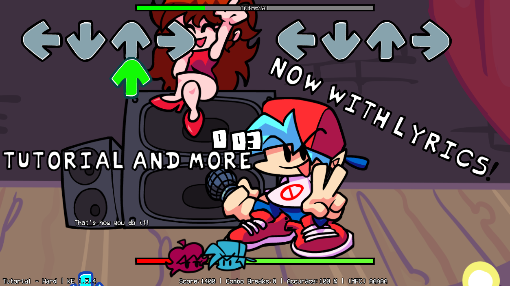

## How to setup the lyrical file support in source code?
- You actually need to change two source files. `PlayState.hx` and `Paths.hx`.
1. Open `Paths.hx` and look for this code:
```haxe
inline static public function txt(key:String, ?library:String)
{
	return getPath('data/$key.txt', TEXT, library);
}
```
and put this code below:
```haxe
inline static public function lyric(key:String, ?library:String) // Lyrical files
{
	return getPath('data/$key.lyric', TEXT, library);
}
```
after you did that you can go to the next step.

2. Open `PlayState.hx`.
- 1. Put your code below this code:
```haxe
public static var highestCombo:Int = 0;

private var executeModchart = false;
```
or above this code:
```haxe
// API stuff

public function addObject(object:FlxBasic) { add(object); }
public function removeObject(object:FlxBasic) { remove(object); }
```
and put your code:
```haxe
var hasLyrics:Bool = false;

var lyricSteps:Array<String>;
var curLyrStep:String = '';
var lyrText:String = '';
var lyrAdded:Bool = false;

var lyrObj:FlxText;
```
so it should look like that:
```haxe
public static var highestCombo:Int = 0;

private var executeModchart = false;

var hasLyrics:Bool = false;

var lyricSteps:Array<String>;
var curLyrStep:String = '';
var lyrText:String = '';
var lyrAdded:Bool = false;

var lyrObj:FlxText;

// API stuff

public function addObject(object:FlxBasic) { add(object); }
public function removeObject(object:FlxBasic) { remove(object); }
```
- 2. After you put your previous code, below this code:
```haxe
if (FlxG.sound.music != null)
	FlxG.sound.music.stop();
```
put this:
```haxe
hasLyrics = FileSystem.exists(Paths.lyric(PlayState.SONG.song.toLowerCase()  + "/lyrics"));
trace('Lyric File: ' + hasLyrics + " - " + Paths.lyric(PlayState.SONG.song.toLowerCase() + "/lyrics"));

lyricSteps = null;
if (hasLyrics)
{
	lyricSteps = CoolUtil.coolTextFile(Paths.lyric(PlayState.SONG.song.toLowerCase() + "/lyrics"));
	var splitStep:Array<String> = lyricSteps[0].split(":");
	curLyrStep = splitStep[1];
	lyrText = lyricSteps[0].substr(splitStep[1].length + 2).trim();
}
```
- 3. Below this short code:
```haxe
repPresses = 0;
repReleases = 0;
```
put:
```haxe
lyrAdded = false;
```
- 4. Below this code:
```haxe
iconP1 = new HealthIcon(SONG.player1, true);
iconP1.y = healthBar.y - (iconP1.height / 2);
add(iconP1);

iconP2 = new HealthIcon(SONG.player2, false);
iconP2.y = healthBar.y - (iconP2.height / 2);
add(iconP2);
```
put
```haxe
lyrObj = new FlxText(0, 0, 0, "", 36);
lyrObj.setFormat(Paths.font("vcr.ttf"), 16, FlxColor.WHITE, CENTER, FlxTextBorderStyle.OUTLINE,FlxColor.BLACK); // You can change the font to whatever you want, just put it to assets/fonts path.
lyrObj.scrollFactor.set();
lyrObj.alignment = CENTER;
lyrObj.screenCenter();
lyrObj.x -= 450;
lyrObj.y += 200;
add(lyrObj);
lyrObj.text = '';
```
- 5. Between these lines which are close to previous code:
```haxe
scoreTxt.cameras = [camHUD];
doof.cameras = [camHUD];
```
put
```haxe
lyrObj.cameras = [camHUD];
```
so this code will look like that:
```haxe
scoreTxt.cameras = [camHUD];
lyrObj.cameras = [camHUD];
doof.cameras = [camHUD];
```
- 6. In the `stepHit()` function above this code:
```haxe
// yes this updates every step.
// yes this is bad
// but i'm doing it to update misses and accuracy
#if windows
// Song duration in a float, useful for the time left feature
songLength = FlxG.sound.music.length;
// Updating Discord Rich Presence (with Time Left)
DiscordClient.changePresence(detailsText + " " + SONG.song + " (" + storyDifficultyText + ") " + Ratings.GenerateLetterRank(accuracy), "Acc: " + HelperFunctions.truncateFloat(accuracy, 2) + "% | Score: " + songScore + " | Misses: " + misses  , iconRPC,true,  songLength - Conductor.songPosition);
#end
```
put this code:
```haxe
if ((("" +curStep) == curLyrStep) && hasLyrics)
{
	if (lyrAdded = false)
	{
		lyrAdded = true;
	}
	lyrObj.text = lyrText;
	trace(lyrText);
	lyricSteps.remove(lyricSteps[0]);
	var splitStep:Array<String> = lyricSteps[0].split(":");
	curLyrStep = splitStep[1];
	lyrText = lyricSteps[0].substr(splitStep[1].length + 2).trim();
}
```
## How to use it if I did the setup?
- Everything is explained on [GameJolt page](https://gamejolt.com/games/fnf_lyrics_moment/674546). I don't want to explain it here.
## Can I setup lyrics with my custom font?
- Yes, you can.
- - 1. Put your custom font in `assets/fonts` (**IT HAS TO BE IN THE SOURCE CODE!**). The file extension has to be `.ttf` or `.otf` format.
- - 2. Edit `PlayState.hx` and in this line:
```haxe
lyrObj.setFormat(Paths.font("vcr.ttf"), 16, FlxColor.WHITE, CENTER, FlxTextBorderStyle.OUTLINE,FlxColor.BLACK);
```
you can change the `vcr.ttf` to whatever you want, but remember the font has to in `assets/fonts` path.